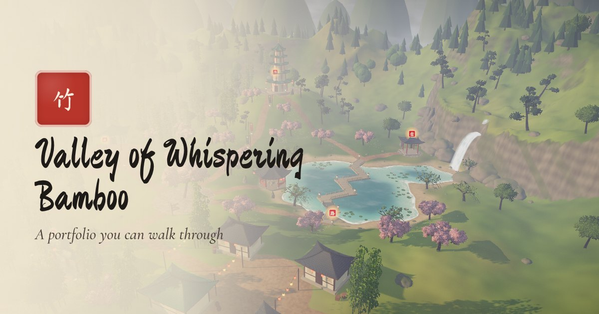
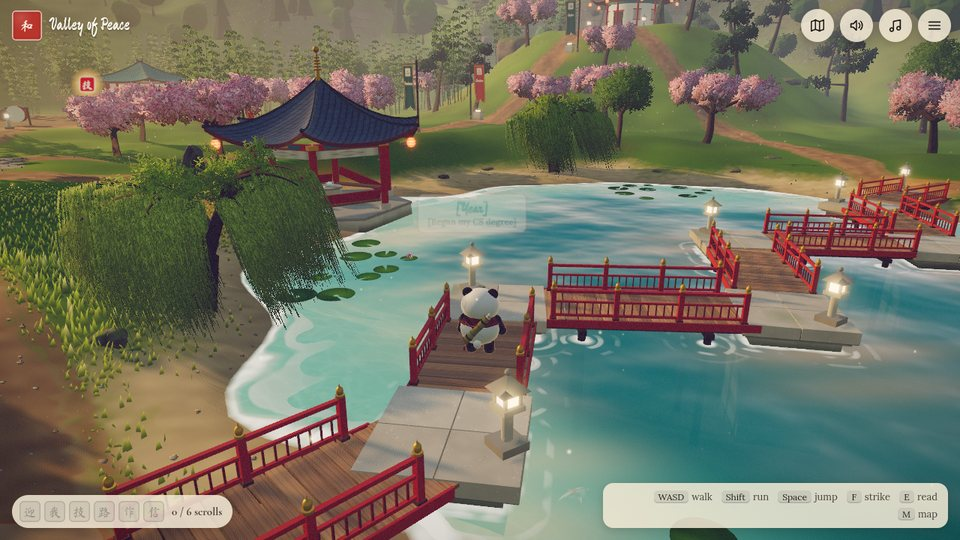
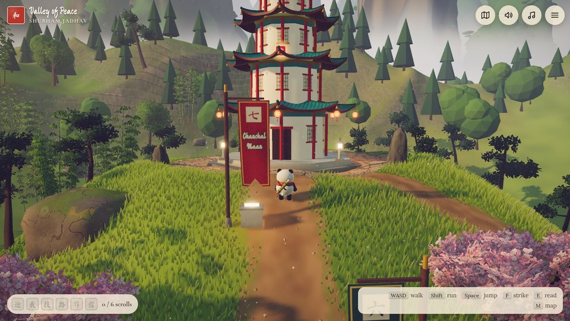
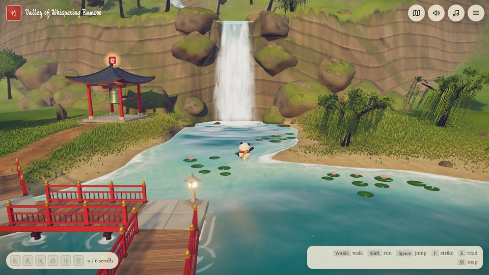
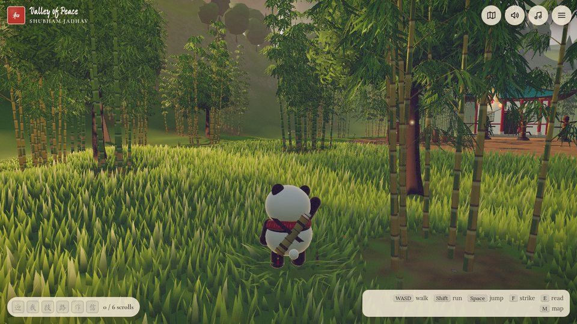
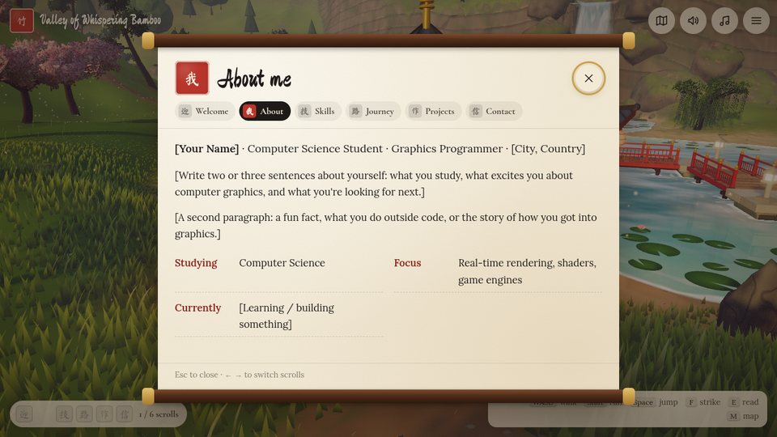
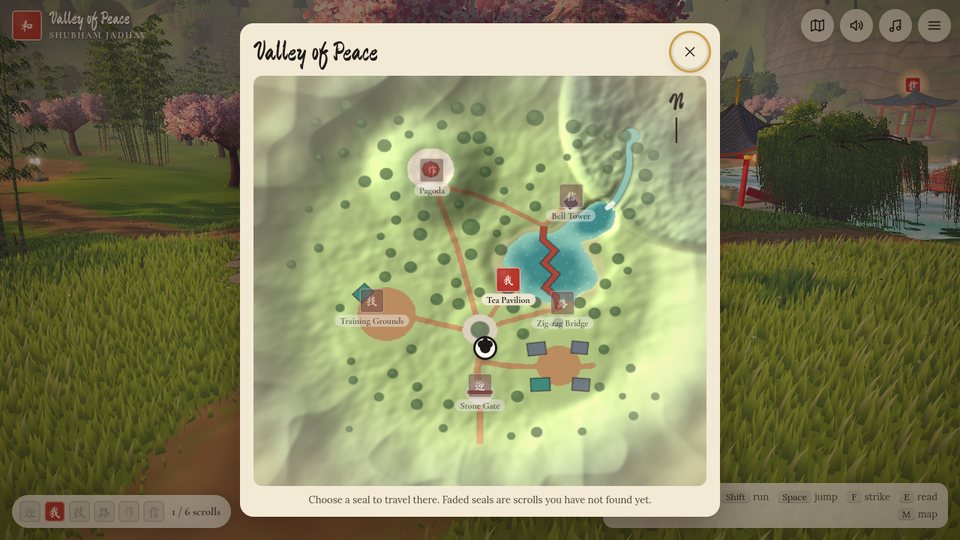
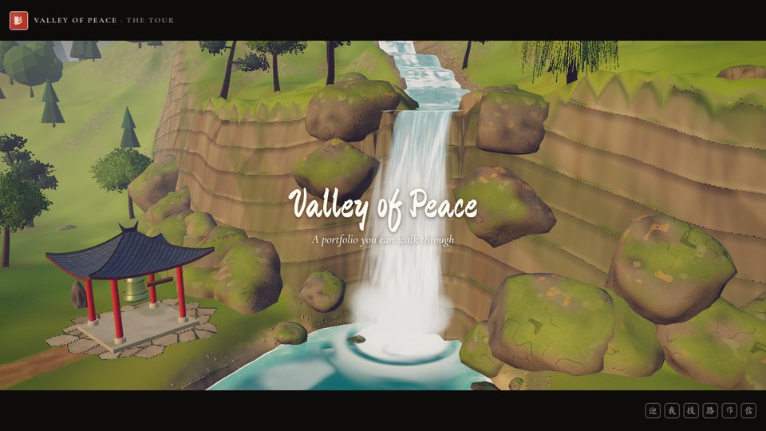

# Valley of Whispering Bamboo 竹



An explorable 3D portfolio. Guide a panda through a misty valley of bamboo groves,
blossom trees, a koi lake fed by a mountain waterfall and a hilltop pagoda, with
butterflies drifting over the meadows and lanterns glowing in the evening light. Every
landmark holds a scroll with a piece of the author's story: who they are, what they can
do, what they have built and how to reach them. Finding a scroll for the first time is a small ceremony: the panda bows, a
ring of golden ink spreads through the grass, a seal is stamped and the scroll unrolls.

Built with **three.js**, **TypeScript** and hand-written **GLSL**. Every model, texture,
sound and note of music is generated in code; there are no downloaded assets besides fonts.

|      |  |
| -------------------------------------------------------------------------------------- | ----------------------------------------------------------------------------------- |
|  |            |
|                      |                           |

## Play

| Action             | Keyboard                      | Gamepad           | Touch                    |
| ------------------ | ----------------------------- | ----------------- | ------------------------ |
| Walk               | `WASD` / arrow keys           | left stick        | joystick (left thumb)    |
| Run                | hold `Shift`                  | `RB` / `RT`       | push the joystick fully  |
| Jump               | `Space`                       | `A`               | ⤒ button                 |
| Kung-fu strike     | `F`                           | `X`               | 拳 button                |
| Read / interact    | `E` / `Enter`                 | `Y`               | `E` button or the prompt |
| Map & quick travel | `M`                           | `Back` / `Select` | map button               |
| Mute               | `N`                           | —                 | speaker button           |
| Help               | `H`                           | `Start`           | menu → How to play       |
| Close / menu       | `Esc`                         | `B`               | ✕ / menu button          |
| Look around        | drag the mouse, wheel to zoom | right stick       | drag on the right side   |

Prefer reading? **Menu → Read as a page** shows the whole portfolio as a plain, accessible
page. Browsers without WebGL 2 or JavaScript get that page automatically.

### Watch the tour



Rather sit back? **Watch the tour** (on the title screen, or in the menu) plays the valley
as a short film of a little over five minutes. It opens with a flight from the waterfall
down to the panda, who waves at the viewer, then follows it from the gate to the bell on
its own while the camera glides on smooth Bezier paths: through the bamboo, past the
lanterns and the signpost, over the meadow as butterflies take off, down the village
street, low over the lake past the koi and up to the bridge and the falls. Every discovery
plays out (the scroll rises from the panda once it has bowed), every scroll stays open long
enough to read, each dummy shows the skills it guards, the bell is rung. Share a link
ending in `?tour` to make the tour the first choice on the title screen.

| While watching          | Keyboard           | Gamepad       | Touch / mouse           |
| ----------------------- | ------------------ | ------------- | ----------------------- |
| Pause / resume          | `Space`            | `A`           | ❚❚ button               |
| Next chapter / continue | `Enter` / `E`      | `Y` / D-pad → | ⏭ button, chapter seals |
| Take the controls       | `Esc` or just walk | `B` / stick   | "Take the controls"     |

## Make it yours

1. **Content.** Everything personal lives in one typed file:
   [`src/content/portfolio.ts`](src/content/portfolio.ts). Replace every `[placeholder]`
   and `TODO` with your name, bio, skills, projects, journey and links. The valley adapts:
   every project gets its own banner, every skill group its own training dummy, every
   milestone its own turn of the bridge.
2. **Links.** Set `site.sourceUrl` to your repository to show a "Source code" link in the
   menu. `site.url` is only needed if you host somewhere other than GitHub Pages.
3. **Preview image.** Shared links unfurl with [`public/og-image.jpg`](public/og-image.jpg).
   After filling in your name, run `npm run dev` and then `npm run og-image` to render a
   fresh one with your name on it.
4. **Gate lettering.** `site.gateGlyphs` must use characters from the brush-font subset;
   add new ones with [`scripts/subset-font.py`](scripts/subset-font.py).
5. **Tour narration.** The tour's captions have friendly defaults; write your own in
   `tour.captions` (one line per scene: `prologue`, the six sections, `epilogue`). The
   chapters themselves live in [`src/tour/script.ts`](src/tour/script.ts).

## Develop

```bash
npm install
npm run dev        # dev server (add ?debug to the URL for the tweak panel and FPS)
npm run check      # typecheck + lint + unit tests + production build
npm run e2e        # headless playthrough of every discovery (needs the dev server)
npm run tour       # headless run of the whole tour, fast-forwarded (needs the dev server)
npm run shots      # reference screenshots into screenshots/ (needs the dev server)
npm run og-image   # re-render the link-preview image (needs the dev server)
```

Requires Node 22.12+. The e2e and screenshot scripts drive Chromium through
`playwright-core`; point `CHROMIUM_PATH` at a local Chrome or Chromium if needed.

Useful URL parameters: `?quality=low|medium|high`, `?adaptive=0` (fixed resolution),
`?debug`, `?tour` (the tour is the main choice on the title screen), `?sim=N` (N simulation
steps per frame: fast-forwards time for tests on slow machines).

## Deploy

Push to GitHub and enable **Settings → Pages → Source: GitHub Actions**. The
[`deploy`](.github/workflows/deploy.yml) workflow publishes every push to `main` to
`https://<user>.github.io/<repo>/` and fills in the absolute URLs that link previews need.
The build uses relative paths, so `dist/` also works on any static host (Netlify, Vercel,
Cloudflare Pages, itch.io…); set `site.url` in the content file there.

## How it is built

- `src/app` – the engine loop (`App`) and the gameplay layer (`Game`)
- `src/world` – terrain, sky, nature, water and architecture, all procedural
- `src/player` – kinematic controller, the procedural panda, its animation and scarf
- `src/zones` – interactive spots, discovery progress and beacons
- `src/audio` – Web Audio synthesis: instruments, generative music, effects, ambience
- `src/ui` – HUD, scrolls, map, menu, touch controls and the page view
- `tools/portfolio-html.ts` – writes the content into `index.html` for search engines,
  link previews and visitors without JavaScript

Read more in the [design document](docs/DESIGN.md), the [roadmap](docs/ROADMAP.md), the
[changelog](CHANGELOG.md) and the [contributing guide](CONTRIBUTING.md).

## Credits

- Inspired by playful explorable portfolios such as Bruno Simon's, and by classical
  Chinese landscape painting.
- Brush lettering: [Ma Shan Zheng](https://fonts.google.com/specimen/Ma+Shan+Zheng) (OFL).
  Text: [Cormorant Garamond](https://fonts.google.com/specimen/Cormorant+Garamond) and
  [Lora](https://fonts.google.com/specimen/Lora) (OFL).

## License

Code: [MIT](LICENSE). Fonts: SIL Open Font License 1.1.
